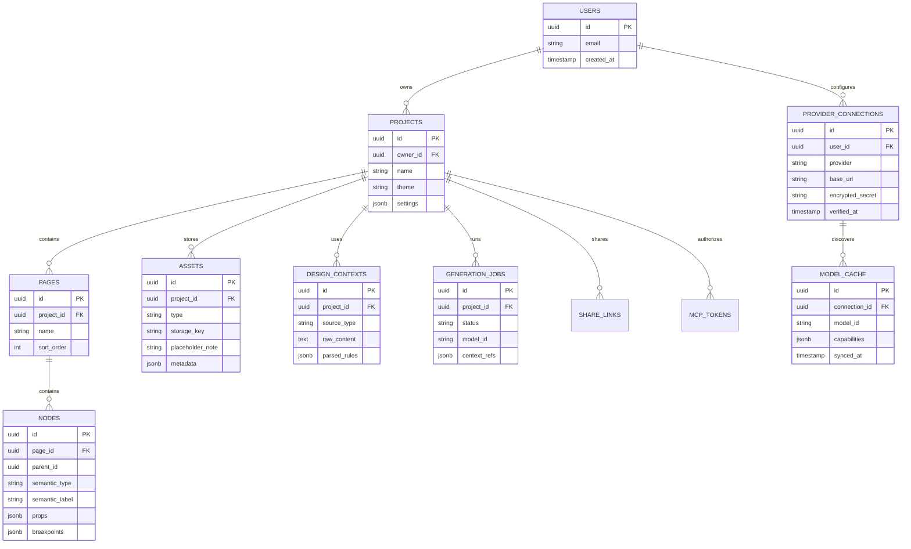
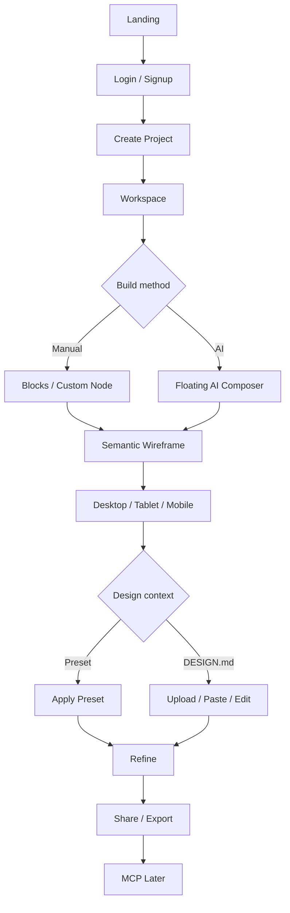
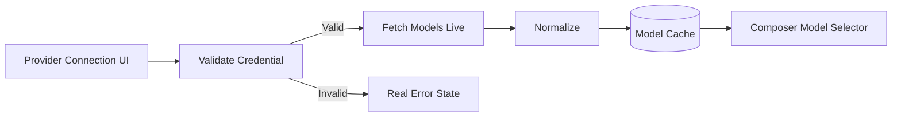

# Product Requirements Document (PRD)

**Nama Proyek:** FORME — by Mavent  
**Versi Dokumen:** v0.2  
**Terakhir Diperbarui:** 24 September 2026  
**Author:** Stellan Vallis  
**Dibuat dengan:** AnyMD by Maventlabs

> `prd.md` mendefinisikan **apa yang harus dibangun**. `DESIGN.md` adalah visual source of truth. `AGENTS.md` mengatur cara implementasi. `SESSION.md` mencatat state, evidence, keputusan, blocker, dan next action.
>
> Agent **MUST membaca keempat file tersebut sebelum bekerja**. Jika aturan visual implementasi bertentangan dengan `DESIGN.md`, ikuti `DESIGN.md` kecuali ada keputusan produk baru yang eksplisit.
>
> **Completion rule:** task baru boleh selesai jika user journey nyata bekerja end-to-end melalui provider/durable boundary yang benar, termasuk success, failure, persistence, dan evidence. Unit test, mock, local adapter, compile, dan build adalah prework, bukan completion.
>
> **Production breadth-first:** buat thin vertical slice untuk seluruh `High/P0` terlebih dahulu, lalu depth pass untuk reliability, accessibility, security, performance, dan polish.
>
> **Reference-first design:** sebelum membuat major landing section atau interaksi workspace, agent MUST memakai skill/tool/MCP/reference-search yang relevan dan tersedia untuk mempelajari referensi. Referensi prioritas: Refero, Awwwards, Behance, Dribbble, Pinterest, Rootly, Retool, ElevenLabs, Raycast, Melius, Linear, Framer, dan referensi berkualitas lain yang relevan. Ambil prinsip komposisi/interaksi, bukan copy pixel-perfect.
> **Primary visual reference pool:**  
> Refero — https://refero.design/  
> Awwwards — https://www.awwwards.com/  
> Behance — https://www.behance.net/  
> Dribbble — https://dribbble.com/  
> Pinterest — https://www.pinterest.com/  
> Rootly — https://rootly.com/  
> Retool — https://retool.com/  
> ElevenLabs — https://elevenlabs.io/  
> Raycast — https://www.raycast.com/  
> Melius — https://www.melius.com/  
> Linear — https://linear.app/  
> Framer — https://www.framer.com/
>
> Gunakan source yang paling relevan untuk section/component yang sedang
> dikerjakan. Detail aturan visual dan cara mengadaptasi reference mengikuti
> `DESIGN.md`.
---

## Pre-P0 Brand Asset Preparation Gate

Before any `High/P0` UI implementation begins, FORME must complete a mandatory brand-asset preflight.

**Canonical logo extraction source:** `forme_logo_assets_master_sheet.png.png`

Requirements:

- use the existing approved artwork from the master sheet;
- manually crop/extract required variants rather than redesigning or regenerating the logo;
- preserve transparent background, geometry, proportions, spacing, and lockup composition;
- use the approved white logo/mark for the dark workspace;
- use the approved primary/main logo from the sheet for landing/light surfaces;
- use the approved app-icon artwork from the same sheet for app icon/favicon usage;
- treat `forme_brand_identity_master_board.png` as a presentation/reference board, not the preferred production extraction source;
- `forme_logo_mark_white.png` may be used as a convenience export for dark workspace only when it matches the master-sheet white variant;
- record every extracted variant and actual production path in `SESSION.md`.
- By explicit product decision on 2026-09-25, deterministic local raster cleanup of pixels outside the approved artwork is allowed for contaminated crop regions; the pure-white workspace symbol may be derived from the cleaned red symbol's identical alpha mask. Preserve geometry/antialiased edges and record crop/cleanup verification in `SESSION.md`.

This gate must be completed before Phase 1 visual implementation proceeds. Missing standalone logo exports are **not** a reason to redesign the brand: crop the needed approved asset from the master sheet first.

## 0. Hierarki Eksekusi & Prioritas

Urutan otoritas:

1. Product goal & measurable outcomes
2. Fitur & sub-fitur
3. Development phases
4. Tasks
5. Acceptance criteria
6. Verification evidence

| Label | Padanan | Arti |
|---|---|---|
| `High` | `P0` | Release-blocking core journey |
| `Medium` | `P1` | Penting setelah core stabil |
| `Low` | `P2` | Optional enhancement/polish |

Parent tidak boleh selesai sebelum child relevan dan evidence di `SESSION.md` selesai.

---

## 1. Product Overview

**Deskripsi Produk:**  
FORME adalah workspace wireframing AI-assisted yang menggabungkan infinite canvas, semantic block system, responsive frames, floating AI Composer, curated design presets, manual `DESIGN.md` context, BYOK multi-provider AI, dan handoff ke coding agent. Produk ini dibuat sebagai **design intelligence layer** untuk developer/founder yang ingin menghasilkan struktur UI yang lebih terarah sebelum coding.

**Problem Statement:**  
Coding agent dapat menghasilkan frontend dengan cepat tetapi sering menghasilkan UI generik, hierarchy lemah, spacing inkonsisten, dan visual language yang tidak bertahan antar-session. FORME memberi user workspace visual untuk membangun wireframe manual atau lewat AI, menyimpan struktur secara semantic, dan memberi agent konteks desain yang persistent.

**Target User:**
- AI-native developer menggunakan Claude Code, Codex, Cursor, OpenCode, Windsurf, atau tool sejenis.
- Solo founder/fullstack developer tanpa designer tetap.
- Designer-engineer hybrid yang butuh wireframe cepat dan agent handoff.

**Bahasa Output:** ikuti bahasa input user; UI utama dapat menggunakan Bahasa Indonesia/English sesuai locale. Unicode harus dipertahankan.

**Platform Support:** Web desktop-first. Workspace wajib usable pada laptop/desktop; landing/auth responsif mobile.

**Out of Scope v0.2:**
- Figma replacement penuh: pen tool, vector boolean ops, illustration engine, complex prototyping.
- Video editor atau video block playable; MVP hanya image + GIF.
- Realtime multiplayer/comments.
- Automatic `DESIGN.md` generation — **Coming Soon**.
- Website crawl → wireframe otomatis — **Coming Soon**.
- Ignix provider connection — **Coming Soon**.
- MCP/write-agent integration sebelum workspace core stabil.
- Pixel-perfect cloning website pihak ketiga.

---

## 2. Unique Selling Proposition (USP)

FORME adalah **wireframe-first design workspace untuk AI coding workflow**, bukan generic AI website generator.

- **Semantic by default:** node disimpan sebagai `Hero`, `Heading`, `Image`, `Card`, `Navbar`, dll., bukan sekadar rectangle.
- **AI inside the canvas:** AI Composer mengambang langsung di canvas, dapat menerima mention `@page`, `@node`, `@component`, dan `@file`.
- **Model-agnostic/BYOK:** provider disambungkan user, model di-fetch live setelah credential valid.
- **Design context persistence:** preset dan manual `DESIGN.md` memberi aturan yang konsisten ke project.
- **Responsive single identity:** satu node punya layout berbeda per breakpoint tanpa menggandakan semantic identity.
- **Professional visual discipline:** anti-emoji, anti-gradient default, low text density, neutral dark workspace, research-first section design.
- **Future agent handoff:** MCP dikerjakan setelah core workspace final agar schema tidak drift.

---

## 3. Fitur & Sub-Fitur

### Fitur 1 — Landing Page & Brand Experience
**Prioritas:** High/P0  
**Bergantung pada:** `DESIGN.md`

- **10-section landing page** — Navbar, 100svh Hero, Product Proof, Block Wireframing, AI Composer, Presets + DESIGN.md, BYOM/Providers, Workflow, Pricing, Closing CTA/Footer.
  - Acceptance: seluruh section mengikuti `DESIGN.md`, tidak generic AI-slop, responsif, dan menggunakan real/product-like visuals.
- **Navbar morph** — lebar saat top, menjadi compact floating navbar saat scroll.
  - Acceptance: transisi smooth untuk width/height/padding/radius/surface tanpa layout jump.
- **Motion-rich presentation** — text reveal, section entrance, product-state transitions, typing hanya untuk Composer demo.
  - Acceptance: `prefers-reduced-motion` didukung.
- **Page navigation** — navbar mengarah ke halaman nyata, bukan fake section anchor sebagai default.
- **Asset placeholder policy** — jika screenshot/photo/illustration final belum tersedia, gunakan neutral placeholder yang jelas dan beri note apa asset yang cocok.
  - Contoh note: `PLACEHOLDER — ideal asset: screenshot dark workspace dengan AI Composer mengedit Hero pada Desktop + Mobile frame`.
  - Acceptance: tidak memakai stock image acak, tidak generate gambar dekoratif hanya untuk mengisi ruang, dan semua placeholder mudah dicari/diganti di akhir.
- **2026-09-25 landing expansion:** minimum sembilan section bermakna; post-hero ecosystem marquee (logo pihak ketiga bukan customer proof), interactive fully visible hero preview, scroll-linked Blocks → Composer → Design Direction stage, asymmetric bento, four horizontal workflow cards, FAQ before closing CTA/footer, and page-level navigation to Workspace, DESIGN.md generator, Crawler, Login, and Mavent product portfolio. Informational Coming Soon pages cannot simulate an active crawler/generator/login/workspace.
- **2026-09-25 pricing model:** proprietary FORME with three monthly subscription offers; the former conditional PAYG/wallet idea is superseded. BYOK provider inference charges are separate. Display proposals as proposals until price/terms and actual billing are activated; no fake checkout. Actual paid transaction requires its own approved production boundary.
- **Mavent product directory:** show only supplied product names and neutral screenshot/description/link placeholders for products other than FORME. Wait for owner-provided official copy and URLs; do not infer them from web search.

### Fitur 2 — Authentication & Project Entry
**Prioritas:** High/P0

- Login/signup via Google, GitHub, email/password.
- Successful login/signup opens the authenticated product hub at `/projects`.
- The hub’s slide navigation contains Workspace, Generator, and Cloning.
- Workspace lists only the signed-in user’s persisted projects, shows previews derived from saved canvas nodes, and supports create/open/search/recent/all.
- Generator and Cloning routes stay visible but explicitly Coming Soon until their production flows are implemented; neither may accept input or imply success.
- The hub supports dark/light appearance while the landing remains fixed light.
- Create project memilih blank canvas atau preset awal.
- Acceptance: redirect after signup/login, session persistence, logout, owner-only project access, and hub routes remain protected.

### Fitur 3 — Workspace Shell
**Prioritas:** High/P0

- **Left rail:** FORME logo, File, Agents, Assets, Tools, Variables.
- **Right panel:** Profile rectangular control → Share → Export → Inspector.
- **Infinite canvas** sebagai area utama.
- **Dark-first workspace** full neutral; tidak ada crimson/maroon pada dark chrome.
- Optional light workspace menggunakan putih/gray dan crimson secara terbatas.
- Acceptance: panel resize/scroll tidak merusak canvas; keyboard focus terlihat; shell tetap usable pada 1280px+.

### Fitur 4 — Semantic Block System
**Prioritas:** High/P0  
**Bergantung pada:** Fitur 3

- **Floating Tool Dock** di dalam canvas; Mouse Pointer/Select dan Text selalu terlihat.
- Top-level: Select, Frame, Text, Media, Container, Blocks, More.
- **Primitives:** Text, Heading, Paragraph, Image, GIF, Button, Input, Divider, Spacer, Container, Stack, Grid.
- **UI Blocks:** Navbar, Footer, Card, Form, Search, Tabs, Accordion, Sidebar, Breadcrumb, Pagination, Table, List, Badge, Avatar, Alert, Modal placeholder, Dropdown, Stats, Quote, Logo Cloud.
- **Section Templates:** Hero, Features, Pricing, Testimonials, FAQ, CTA, Gallery, Stats, Team, Contact, Blog List, Dashboard Header/Sidebar, Settings, Authentication.
- **Custom block:** user dapat membuat ukuran sendiri, semantic label sendiri, dan children sendiri.
- Acceptance: drag-to-place membuat semantic node valid; dropdown digunakan agar dock tidak membengkak.

### Fitur 5 — Canvas, Layout & Inspector
**Prioritas:** High/P0  
**Bergantung pada:** Fitur 3–4

- Node dapat di-select, move, resize, duplicate, delete, reorder.
- Inspector: X/Y, width/height, padding, gap, alignment, typography, fill/border, semantic label, visibility.
- Ukuran px ditampilkan dengan Geist Mono.
- Default layout: flow/stack/grid; absolute positioning opt-in.
- Snap-to-grid 8px dapat toggle.
- Layers merepresentasikan node instance; Blocks merepresentasikan template.
- Acceptance: visual edit memperbarui source data yang sama, undo/redo bekerja, tidak ada node orphan.

### Fitur 6 — Responsive Frames
**Prioritas:** High/P0  
**Bergantung pada:** Fitur 5

- Preset default: Desktop 1440px, Tablet 768px, Mobile 390px.
- Width dapat diubah manual; frame height auto/content-driven.
- Satu semantic node identity, layout berbeda per breakpoint.
- Side-by-side Desktop/Mobile preview.
- Per-breakpoint: size, order, alignment, position, visibility.
- Acceptance: edit content/label sinkron antar-breakpoint; layout override tidak merusak breakpoint lain.

### Fitur 7 — Semantic Wireframe Visual System
**Prioritas:** High/P0

- Wireframe selalu grayscale.
- Lighter gray = structural/background layer; darker gray = nearer/content-level block.
- Differentiation utama melalui silhouette, icon, label, border, placeholder pattern.
- Image/GIF dapat menggunakan placeholder visual sampai asset nyata tersedia.
- Placeholder asset wajib punya note yang menjelaskan jenis gambar ideal, aspect ratio/role, dan konteks penempatan.
- Acceptance: brand crimson tidak bocor ke wireframe; user dapat membedakan heading, text, media, button, input, card tanpa color-coding acak.

### Fitur 8 — Floating AI Composer
**Prioritas:** High/P0  
**Bergantung pada:** Fitur 5

- Composer mengambang **di dalam canvas**, bukan bottom application menu.
- Input mendukung `+`, `/`, `@`, Preset, Model, Send.
- `+`: image, GIF, markdown/text, file/reference.
- `@`: page, node, component, file, uploaded reference.
- `/`: create, edit, restructure, responsive, duplicate, lint.
- AI dapat membuat wireframe awal atau mengedit selection tertentu.
- Acceptance: mention benar-benar membatasi context; generation tidak boleh diam-diam mengganti page lain.

### Fitur 9 — AI Provider Connections & Live Model Discovery
**Prioritas:** High/P0

Provider/company:
1. Meta / Muse
2. OpenAI
3. Anthropic / Claude
4. Google / Gemini
5. Alibaba / Qwen
6. Z.ai / GLM
7. Xiaomi / MiMo
8. xAI / Grok
9. Moonshot AI / Kimi
10. DeepSeek
11. MiniMax
12. Ignix — Coming Soon

Tambahan: **OpenAI-Compatible** dengan Base URL + API Key.

- Provider connection UI memakai logo resmi melalui Simple Icons/Devicon/asset resmi.
- API key disimpan encrypted/server-side, tidak pernah dikirim kembali plaintext.
- Setelah connect: validate credential → fetch model list → normalize → cache → tampilkan di Model selector.
- Model tidak boleh di-hardcode sebagai catalog permanen.
- Ignix terlihat tapi disabled dan jujur berlabel Coming Soon.
- Acceptance: invalid key memberi error nyata; model list hanya muncul setelah validation sukses.

### Fitur 10 — Presets & DESIGN.md Context
**Prioritas:** High/P0

- Minimal 10 curated design presets; dapat dipilih sebelum atau sesudah wireframe.
- Preset memengaruhi spacing, density, grid, radius, section rhythm, typography, component geometry, bukan sekadar warna.
- User dapat upload, paste, atau menulis/edit `DESIGN.md`.
- Parser mengubah context menjadi rules yang dapat dipakai AI Composer/project.
- **Generate DESIGN.md = Coming Soon** dan tidak boleh berpura-pura aktif.
- Acceptance: apply preset/DESIGN.md tidak menghapus semantic structure.

### Fitur 11 — Assets, Media & Placeholder Workflow
**Prioritas:** High/P0

- Asset panel untuk image/GIF/uploaded reference.
- Drag & drop file ke canvas/Composer.
- Image block: width, height, aspect ratio, fit.
- GIF block: placeholder/motion indicator; tidak ada full video tooling.
- Jika asset belum ada, placeholder + replacement note wajib tersedia.
- Acceptance: missing asset tidak memblokir layout dan dapat diganti tanpa mengubah struktur node.

### Fitur 12 — Share & Export
**Prioritas:** High/P0

- Share link read-only untuk project/wireframe.
- Export project snapshot/structured data dan image/PDF preview sesuai implementasi final.
- Export tidak boleh fake/dead.
- Acceptance: permission benar dan exported artifact sesuai project state.

### Fitur 13 — Website Import / Crawling
**Prioritas:** Medium/P1 — Coming Soon

- UI entry boleh terlihat sebagai Coming Soon.
- Future flow: URL → extract structure/design principles → semantic wireframe/Design IR.
- Tidak boleh pixel-clone, copy proprietary asset, atau copy content mentah.
- Acceptance future: crawler failure aman, SSRF protection wajib, hasil tetap editable.

### Fitur 14 — AnyMD → FORME Handoff
**Prioritas:** Medium/P1

- Terima `prd.md` dari AnyMD sebagai project brief/context.
- User dapat review/edit sebelum AI Composer menggunakannya.
- Billing/account tetap terpisah kecuali ada keputusan baru.

### Fitur 15 — MCP / Agent Handoff
**Prioritas:** Medium/P1 — dikerjakan terakhir

- Baru dimulai setelah Canvas/Node/Design Context schema stabil.
- Read tools: project, page, node, tokens/design rules, wireframe, lint.
- Distribusi via package npm/npx.
- Scoped project token, revocable.
- Write access ditunda sampai read contract stabil.

---

## 4. Development Phases

### Phase 0 — Brand Asset Preparation (Pre-P0 Mandatory Gate)

**Prioritas:** Pre-P0 prerequisite  
**Mode:** Asset preflight / verification

- [ ] Locate `forme_logo_assets_master_sheet.png.png` in the repository/project assets.
- [ ] Inspect the sheet before modifying any P0 landing/workspace branding.
- [ ] Manually crop/extract the production logo variants actually required.
- [ ] Preserve transparent background and original geometry/spacing.
- [ ] Prepare the approved primary/main logo for landing/light surfaces.
- [ ] Prepare the approved white logo/mark for dark workspace usage.
- [ ] Prepare app icon variant(s) directly from the sheet.
- [ ] Reuse `forme_logo_mark_white.png` only if it matches the approved master-sheet white variant.
- [ ] Place extracted assets in the repository's existing brand-asset path; if none exists, use `public/brand/forme/`.
- [ ] Record source → output mapping in `SESSION.md` Logo Asset Extraction Ledger.
- [ ] Verify no logo variant was regenerated, redrawn, auto-traced, recolored arbitrarily, or distorted.

**Anggap fase ini selesai kalau:** setiap logo asset required by the first P0 slice exists as a clean production file, its provenance from the master sheet is recorded, the dark workspace has an approved white mark available, and the app icon is sourced from the existing sheet rather than recreated.

### Phase 1 — Design Contract + Landing
**Prioritas:** High/P0 · **Mode:** Breadth pass  
- [ ] Implement global tokens dari `DESIGN.md`
- [ ] Build 10 landing sections
- [ ] Navbar morph + motion + reduced-motion
- [ ] Placeholder asset component + replacement-note convention
- [ ] Responsive landing QA
**Selesai jika:** landing production path utuh, profesional, tidak generic, dan semua missing imagery punya placeholder note.

### Phase 2 — Auth + Project Shell
- [ ] Google/GitHub/email auth
- [ ] Project dashboard
- [ ] Workspace shell, dark/light mode
- [ ] Left rail + right profile/share/export/inspector
**Selesai jika:** authenticated user dapat membuat dan membuka project nyata.

### Phase 3 — Block/Node Schema + Canvas
- [ ] Define canonical node/block schema
- [ ] Floating tool dock
- [ ] Drag/place/select/resize/reorder
- [ ] Layers + Inspector
- [ ] Undo/redo + persistence
**Selesai jika:** manual wireframe dapat dibuat, disimpan, reload, dan diedit lagi.

### Phase 4 — Responsive Wireframe
- [ ] Desktop/Tablet/Mobile frames
- [ ] Per-breakpoint layout data
- [ ] Side-by-side preview
- [ ] Grayscale semantic block renderer
- [ ] Asset placeholder workflow
**Selesai jika:** satu node identity bekerja konsisten lintas breakpoint.

### Phase 5 — AI Composer + Provider Layer
- [x] Floating Composer in canvas — first Gemini-backed text-edit slice
- [ ] `/` commands, broad `@` references, upload context
- [x] Provider connection UI — Google Gemini first adapter
- [x] Credential validation and server-side encrypted persistence
- [x] Live model discovery/normalization/cache
- [x] Selection-aware scoped text edit through Design IR + revisioned canvas persistence
- [ ] Scoped node creation/restructure and remaining Composer controls/providers
**Selesai jika:** real provider dapat membuat/mengubah node pada production canvas path.

**2026-09-26 evidence:** Gemini credential/model discovery and selected-node text edit passed real-provider production HTTP E2E against isolated Neon. Phase 5 remains open for scoped create/restructure, upload/command/broader-mention controls, timeout recovery verification, and additional provider adapters.

### Phase 6 — Presets + DESIGN.md
- [ ] Minimal 10 presets
- [ ] Apply before/after wireframe
- [ ] Upload/paste/manual DESIGN.md
- [ ] Parse context into project rules
- [ ] Generate DESIGN.md tampil Coming Soon saja
**Selesai jika:** preset/context mengubah presentation tanpa merusak semantic structure.

### Phase 7 — Share, Export & Product Hardening
- [ ] Read-only share
- [ ] Real export
- [ ] Keyboard/accessibility pass
- [ ] performance profiling
- [ ] error/loading/retry/recovery states

### Phase QA — Pengujian & Verifikasi
- [ ] Unit: node schema, breakpoint rules, parser, provider normalization
- [ ] Integration: auth, persistence, upload, provider, export/share
- [ ] Contract: AI providers/model listing
- [ ] E2E: signup → project → wireframe → responsive → AI edit → DESIGN.md/preset → export/share
- [ ] Failure: invalid key, provider timeout, malformed generation, upload failure, unauthorized share
- [ ] No dead buttons/fake success
- [ ] Record evidence di `SESSION.md`

### Phase Security
- [ ] Input validation/XSS
- [ ] Auth/ownership
- [ ] Encrypt provider credentials
- [ ] Never expose secret back to client
- [ ] Upload validation
- [ ] Rate limit generation
- [ ] Dependency scan
- [ ] SSRF guard prepared before crawler activation
- [ ] Analytics privacy/consent review

### Phase 8 — P1 Extensions
- [ ] AnyMD handoff
- [ ] Website crawler implementation
- [ ] MCP read-only package
- [ ] MCP token/revocation
- [ ] Ignix only after real provider boundary exists

---

## 5. Tech Stack

| Layer | Teknologi | Alasan |
|---|---|---|
| Frontend | Next.js + React + TypeScript | Web app, dashboard, routing |
| Styling | Tailwind CSS v4 + CSS variables | Global design tokens mudah diganti |
| UI icons | Lucide React | Konsisten, anti-emoji |
| Brand icons | Simple Icons / Devicon / official assets | Provider branding |
| Canvas | React DOM-based structured canvas | Semantic blocks lebih penting daripada vector editor |
| State | Zustand + query/server-state layer | Canvas + selection state |
| Database | Neon Postgres | PostgreSQL/JSONB untuk project/node/context |
| Auth | Better Auth / Neon-backed auth | Google, GitHub, email/password |
| Storage | S3-compatible object storage | Image/GIF/reference/export |
| Validation | Zod / JSON Schema | Node, provider, AI output contracts |
| AI | Provider adapter layer | BYOK + live model discovery |
| Animation | Motion/GSAP sesuai kebutuhan | Navbar morph, section/product motion |
| Hosting | Netlify sementara (keputusan 2026-09-26); self-hosted oleh owner sebagai tujuan berikutnya; worker/container bila dibutuhkan | Web + async/provider jobs; lihat `NETLIFY-DEPLOY.md` untuk environment dan batas deployment |
| Monitoring | Sentry + structured logs | Errors/provider reliability |

---

## 5A. Visual Direction

`DESIGN.md` adalah authority untuk seluruh visual implementation.

Ringkasan:
- Landing fixed-light, dominan putih.
- Primary crimson `#7D070B`.
- Alternate button fills hanya `#5B090C` dan `#A30A10`; tidak dikombinasikan.
- Dark workspace grayscale penuh, tanpa crimson.
- Instrument Sans + Geist Mono.
- Lucide UI icons; no emoji.
- Hero minimum `100svh`.
- Product visuals > explanatory text.
- No decorative gradient/glow/generic AI pattern.
- Research-first sebelum setiap major section.

---

## 5B. Logo Asset Source Rule

### Source of Truth

`forme_logo_assets_master_sheet.png.png` is the canonical production source for FORME logo variants.

The implementation agent must crop/extract existing variants from that sheet when a standalone asset file is missing. This is an extraction workflow, not a generation workflow.

### Production Mapping

- **Landing/light surfaces:** approved main/primary logo or lockup from the sheet.
- **Dark workspace:** approved white logo/mark from the sheet.
- **App icon/favicon:** approved app-icon artwork from the sheet.
- **Presentation board:** `forme_brand_identity_master_board.png` is reference-only when the same artwork is available in the master sheet.
- **Existing white export:** `forme_logo_mark_white.png` may be reused only if it matches the master-sheet white mark.

### Prohibitions

The agent must not:
- redesign or reinterpret the logo;
- force a new monogram;
- rebuild the icon from approximate CSS geometry;
- distort proportions;
- add background to a transparent logo export;
- add gradients/glows/shadows;
- create arbitrary red variants;
- use a crimson logo in dark workspace chrome when the approved white variant exists.

### Documentation Requirement

Before P0 implementation continues, record in `SESSION.md`:
- source file inspected;
- extracted variant name;
- output path;
- intended use;
- extraction/verification status.

## 6. Database Schema Diagram



---

## 7. API Documentation

### Projects / Pages / Nodes
| Method | Endpoint | Deskripsi |
|---|---|---|
| POST | `/api/projects` | Create project |
| GET | `/api/projects/:id` | Owned project + canonical canvas document/revision |
| PUT | `/api/projects/:id/canvas` | Replace validated versioned canvas document; requires `expectedRevision`, returns `409` on conflict |
| POST | `/api/projects/:id/pages` | Create page |
| POST | `/api/projects/:id/blocks` | Save a selected semantic subtree as a reusable project block |
| POST | `/api/projects/:id/blocks/:blockId/instances` | Instantiate a saved custom block with new node identities |
| PATCH | `/api/nodes/:id` | Update semantic node with project ownership + expected canvas revision |
| POST | `/api/nodes` | Create block instance with project ownership + expected canvas revision |
| DELETE | `/api/nodes/:id` | Delete node subtree with project ownership + expected canvas revision |

### Assets
| Method | Endpoint | Deskripsi |
|---|---|---|
| POST | `/api/projects/:id/assets` | Upload image/GIF/file |
| PATCH | `/api/assets/:id` | Update metadata/placeholder note |

### AI Providers
| Method | Endpoint | Deskripsi |
|---|---|---|
| GET | `/api/providers` | List owner-scoped connections and normalized cached models; never returns secrets |
| POST | `/api/providers/connect` | Validate/save provider |
| POST | `/api/providers/:id/sync-models` | Live model fetch |
| DELETE | `/api/providers/:id` | Disconnect |

### Composer
| Method | Endpoint | Deskripsi |
|---|---|---|
| POST | `/api/projects/:id/generate` | Create/edit nodes from scoped context |
| GET | `/api/generation/:idempotencyKey` | Owner-scoped generation job status without prompt/result secrets |

### Design Context
| Method | Endpoint | Deskripsi |
|---|---|---|
| POST | `/api/projects/:id/design-context` | Upload/paste DESIGN.md |
| PATCH | `/api/design-context/:id` | Manual edit |
| POST | `/api/projects/:id/preset` | Apply preset |

### Share / Export
| Method | Endpoint | Deskripsi |
|---|---|---|
| POST | `/api/projects/:id/share` | Create read-only share |
| POST | `/api/projects/:id/export` | Real export job |

---

## 8. Additional Diagrams

### Core User Flow



### Provider Flow



---

## 10. Observability, Testing & Product Metrics

Track only after consent; never log prompt/file/document content or API keys.

Events:
- `page_view`
- `signup_completed`
- `project_created`
- `node_created`
- `ai_generation_started`
- `ai_generation_completed`
- `provider_connected`
- `design_context_applied`
- `export_completed`
- `share_created`

Metrics:
- DAU / rolling 30-day MAU
- activation: user reaches first saved wireframe
- AI generation success/failure/p95
- provider connection success
- time-to-first-wireframe
- export/share completion

Local synthetic data validates schemas only; production usage requires durable deployed evidence.

---

## 11. Prompt Inisiasi untuk Agent

```text
Baca DESIGN.md, prd.md, AGENTS.md, dan SESSION.md sebelum mengubah repository.

SEBELUM Phase 1, selesaikan `Phase 0 — Brand Asset Preparation` dan catat hasil ekstraksi logo di SESSION.md.
Gunakan `forme_logo_assets_master_sheet.png.png` sebagai source of truth; jangan redesign logo.

Mulai dari Phase 1 dan kerjakan production breadth-first untuk seluruh High/P0.
Sebelum membuat setiap major landing section atau major workspace interaction,
lakukan reference pass menggunakan design skills, MCP, browser/search, atau tool
relevan yang benar-benar tersedia. Catat tool/reference yang dipakai di SESSION.md.
Jangan copy pixel-perfect.

DESIGN.md adalah visual source of truth. Wajib:
- no emoji; gunakan Lucide React untuk UI dan Simple Icons/Devicon/official asset
  untuk provider;
- landing fixed-light, dominan putih, Crimson #7D070B;
- alternate crimson hanya #5B090C atau #A30A10 sebagai pilihan CTA terpisah,
  tidak dikombinasikan;
- dark workspace full neutral tanpa crimson;
- hero minimal 100svh;
- Composer mengambang di dalam canvas;
- Mouse Pointer/Select dan Text selalu terlihat di floating tool dock;
- hindari gradient dekoratif, glow, generic AI slop, text bloat, pill/card abuse.

Jika gambar/screenshot final belum tersedia, JANGAN cari stock image acak dan jangan
memblokir implementasi. Gunakan placeholder profesional dan tambahkan note spesifik
tentang asset ideal yang harus diganti nanti, termasuk subject, role, dan aspect ratio
bila relevan.

Gunakan provider nyata dan live model discovery saat credential tersedia. Ignix,
automatic DESIGN.md generation, dan website crawl-to-wireframe adalah Coming Soon
dan tidak boleh dibuat sebagai fake working interaction.

Setelah acceptance criteria dan verification phase lulus, lanjut otomatis ke phase
berikutnya. QA, Security, dan Observability wajib sebelum core dianggap selesai.
MCP dikerjakan paling akhir setelah schema Canvas/Node/Design Context stabil.
```

---

## Changelog

| Tanggal | Perubahan |
|---|---|
| 25 September 2026 | Menambahkan mandatory Pre-P0 brand asset gate, canonical logo master-sheet extraction rule, white-logo mapping untuk dark workspace, app-icon extraction, dan SESSION asset provenance ledger requirement. |
| 24 September 2026 | Rewrite v0.2: wireframe-first workspace, floating AI Composer, semantic blocks, responsive frames, BYOK/live model discovery, manual DESIGN.md, placeholder asset policy, research-first landing, Crimson visual contract, Coming Soon crawler/Ignix/MCP sequencing |
