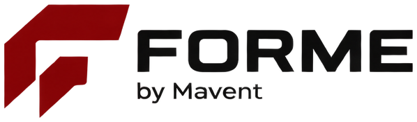
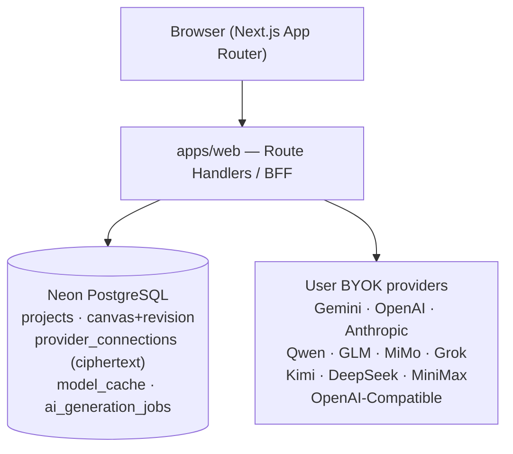
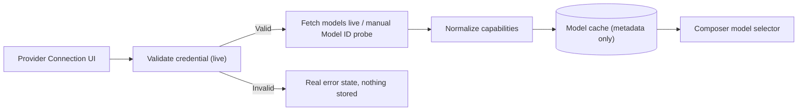
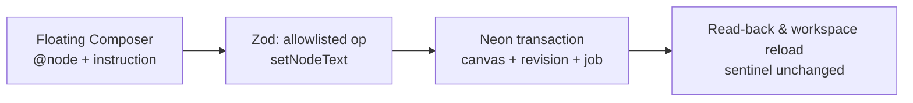

<p align="center">
  
</p>

<h1 align="center">FORME — by Mavent</h1>

<p align="center"><b>Wireframe-first AI design workspace.</b> Semantic canvas, floating AI Composer, and BYOK multi-provider AI — built for the AI coding workflow.</p>

<p align="center">
  
  
  
  
  
  
  
  
  
  
</p>

> **Status demo — masih dalam pengembangan aktif.** Jangan pakai untuk data produksi sungguhan. Harga yang tampil adalah proposal, checkout belum live, dan deployment publik menunggu database production terpisah + final runtime env/domain. Lihat [`NETLIFY-DEPLOY.md`](./NETLIFY-DEPLOY.md) untuk panduan deploy sementara.

---

## Daftar isi

- [Apa itu FORME](#apa-itu-forme)
- [Arsitektur](#arsitektur)
- [Tech stack](#tech-stack)
- [Struktur repo](#struktur-repo)
- [Menjalankan lokal](#menjalankan-lokal)
- [Environment variables](#environment-variables)
- [Provider BYOK](#provider-byok)
- [Testing & E2E](#testing--e2e)
- [Deploy Netlify sementara](#deploy-netlify-sementara)
- [Roadmap](#roadmap)
- [Lisensi](#lisensi)

---

## Apa itu FORME

FORME adalah workspace wireframing dengan AI di dalam canvas:

- **Semantic blocks/nodes** — `Hero`, `Heading`, `Card`, `Navbar`, bukan sekadar rectangle.
- **Floating AI Composer** — `@node` scope, structured output tervalidasi Zod menjadi operasi Design IR.
- **BYOK multi-provider** — user menghubungkan API key miliknya sendiri; server memvalidasi live, mengenkripsi (AES-256-GCM), dan tidak pernah mengembalikan plaintext.
- **Responsive satu identitas** — Desktop 1440 / Tablet 768 / Mobile 390 tanpa menggandakan node.
- **Presets + `DESIGN.md`** — konteks desain manual yang tidak merusak struktur semantik (in progress).
- **Share & export** — read-only link + artifact nyata (in progress).

---

## Arsitektur







Sumber kebenaran: `FORME-PRD.md` (product), `FORME-DESIGN.md` (visual), `TECH-STACK.md` (arsitektur), `AGENTS.md` (aturan eksekusi), `SESSION.md` (ledger eksekusi).

---

## Tech stack

| Layer | Teknologi |
|---|---|
| Frontend | Next.js 16 App Router, React 19, TypeScript 5.9 |
| Styling | Tailwind CSS v4 + CSS variables (`FORME-DESIGN.md`) |
| Icons | Lucide React (UI), Simple Icons / Devicon (brand provider) |
| Canvas | DOM-based semantic canvas, Design IR (`packages/design-ir`) |
| Client state | Zustand (editor) + TanStack Query (server state) |
| Animasi | GSAP (scroll/narasi), Motion bila dibutuhkan |
| Backend | Next.js Route Handlers (Node.js runtime), REST + Zod |
| Database | Neon PostgreSQL + Drizzle ORM |
| Auth | Better Auth (email/password; OAuth belum diimplementasikan) |
| AI | `FormeProviderAdapter` — Gemini, Anthropic, 9 Chat-Completions profile + OpenAI-Compatible |
| Test | `node:test` + `tsx`, script E2E `apps/web/scripts/e2e` |
| Monorepo | pnpm workspace + Turborepo |
| Hosting | Netlify sementara (OpenNext adapter); self-hosted sebagai tujuan akhir |

---

## Struktur repo

```text
forme/
├── apps/web/                  # Next.js App Router (marketing, auth, hub, workspace, API)
│   ├── src/app/               # routes + API handlers
│   ├── src/lib/               # provider adapters, encryption, AI edit, persistence
│   ├── scripts/e2e/           # production E2E runner (satu entrypoint)
│   ├── drizzle/               # migrasi database
│   └── public/brand/forme/    # logo production dari master sheet
├── packages/design-ir/        # canonical semantic canvas schema
├── docs/decisions/            # ADR (mis. hosting sementara Netlify)
├── FORME-PRD.md / FORME-DESIGN.md / TECH-STACK.md / AGENTS.md / SESSION.md
├── NETLIFY-DEPLOY.md          # panduan + estimasi readiness + env deploy
├── netlify.toml               # konfigurasi build Netlify (tanpa secret)
└── README.md
```

---

## Menjalankan lokal

Prasyarat: Node.js 24, pnpm 11, database Neon kosong/isolated untuk dev.

```sh
pnpm install --frozen-lockfile
cp apps/web/.env.example apps/web/.env.local
# isi .env.local dengan nilai lokal (lihat tabel di bawah)
pnpm --filter @forme/web db:generate
pnpm --filter @forme/web db:migrate
pnpm dev
```

Buka `http://localhost:3100`.

---

## Environment variables

> Nilai contoh di bawah adalah **placeholder** — bukan credential asli. Jangan commit file `.env.local`, jangan paste secret ke chat/log, dan jangan menaruh secret di `netlify.toml`.

| Variable | Wajib | Keterangan |
|---|---|---|
| `DATABASE_URL` | Ya | URL Neon **pooled** untuk runtime. |
| `DATABASE_URL_UNPOOLED` | Migrasi lokal | URL Neon **direct (non-pooler)** hanya untuk `db:migrate` dari mesin tepercaya. |
| `BETTER_AUTH_SECRET` | Ya | Random ≥32 byte, unik per environment. |
| `BETTER_AUTH_URL` | Ya | Origin kanonis (`http://localhost:3100` lokal; URL HTTPS Netlify di production). |
| `PROVIDER_SECRET_ENCRYPTION_KEY` | Ya (provider) | Random 32-byte base64url, **berbeda** dari auth secret. Hilang = credential tersimpan tak bisa didekripsi. |
| `PROVIDER_SECRET_ENCRYPTION_KEY_ID` | Ya | Mulai `v1`; hanya berubah saat rotasi terencana. |
| `PROVIDER_SECRET_ENCRYPTION_KEYRING` | Opsional | JSON key lama hanya selama jendela rotasi. |
| `GEMINI_API_KEY` | E2E lokal saja | Dipakai runner E2E lokal; **bukan** credential produk. User normal memakai BYOK masing-masing. |
| `E2E_*` | E2E saja | Konfigurasi test-runner; bukan setting aplikasi production. |

Buat secret baru (jalankan dua kali — satu untuk auth, satu untuk encryption):

```sh
node -e "console.log(require('node:crypto').randomBytes(32).toString('base64url'))"
```

---

## Provider BYOK

1. User memilih provider → memasukkan API key (+ `Base URL` untuk OpenAI-Compatible/Qwen, + `Model ID` bila discovery manual).
2. Server memvalidasi credential **live** ke provider resmi.
3. Credential dienkripsi AES-256-GCM (nonce unik, AAD owner/provider/key-id) sebelum disimpan; respons API tidak pernah berisi plaintext.
4. Model discovery live → normalisasi → cache metadata → tampil di selector Composer.
5. Key invalid/revoked → error nyata, tidak dianggap connected. Disconnect menghapus ciphertext + cache.

Target kompatibilitas utama custom provider: `POST {baseUrl}/v1/chat/completions` (perhatikan plural `completions`), dengan normalisasi Base URL agar `host`, `host/v1`, atau endpoint eksplisit tidak menjadi `/v1/v1` ganda. `/v1/models` dicoba bila tersedia; bila tidak, Model ID manual divalidasi lewat real generation probe. Ignix tetap **Coming Soon**.

---

## Testing & E2E

```sh
pnpm --filter @forme/web test        # unit + contract (51 test)
pnpm --filter @forme/web typecheck
pnpm --filter @forme/web lint
pnpm --filter @forme/web build
pnpm e2e:production                  # production E2E (script-based, tanpa Playwright)
```

E2E memakai build production Next.js + Better Auth + Neon isolated + (bila tersedia) Gemini live. Setiap run memakai identitas unik, cleanup idempotent, timeout jelas, exit non-zero saat gagal, dan **tidak pernah mencetak credential**. E2E OpenAI-Compatible membaca `E2E_OPENAI_COMPATIBLE_BASE_URL` / `E2E_OPENAI_COMPATIBLE_API_KEY` / `E2E_OPENAI_COMPATIBLE_MODEL_ID` bila disediakan owner.

---

## Deploy Netlify sementara

Netlify hanya host **sementara** selagi server sendiri disiapkan. Lihat `NETLIFY-DEPLOY.md` + ADR `docs/decisions/0001-temporary-netlify-host.md`.

Ringkasnya: set base = repo root, package dir `apps/web`, build `pnpm --filter @forme/web build`, Node 24. Isi 5 runtime variables **lewat Netlify UI** (Project configuration → Environment variables), bukan lewat file. Jangan arahkan traffic publik ke database dev/E2E. Function sinkron Netlify dibatasi 60 detik — pekerjaan panjang tetap diarahkan ke arsitektur worker.

---

## Roadmap

- [x] Landing + brand asset gate
- [x] Auth email/password + project hub + workspace shell
- [x] Semantic canvas + revisioned persistence + custom blocks
- [x] Responsive persistence boundary (API/durable)
- [x] Gemini live discovery + scoped text edit (E2E real)
- [x] Canonical BYOK layer: 12 provider ID + OpenAI-Compatible + validasi manual + UI generik
- [ ] Scoped `appendChild`/restructure + timeout recovery E2E
- [ ] Presets + upload/paste/editor `DESIGN.md`
- [ ] Asset upload/storage (S3-compatible, presigned)
- [ ] Share read-only + export artifact nyata
- [ ] QA / Security / Observability release-grade
- [ ] Final full frontend redesign & polish (setelah backend stabil)
- [ ] Production deploy (DB production + domain + env final)

---

## Lisensi

**Proprietary — All rights reserved.** © Mavent. Dilarang menyalin, memodifikasi, mendistribusikan, atau memakai kode ini untuk tujuan apa pun tanpa izin tertulis dari Mavent. Lihat [`LICENSE`](./LICENSE) bila tersedia; bila belum ada file terpisah, ketentuan paragraf ini yang berlaku.
